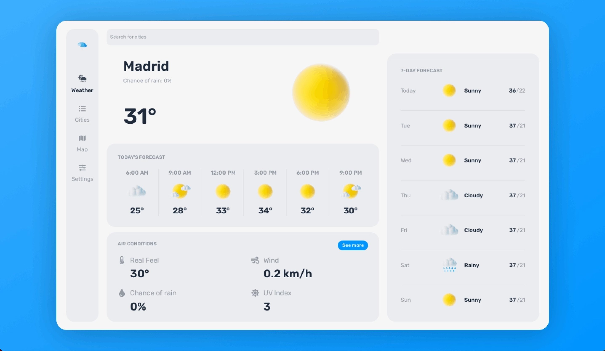
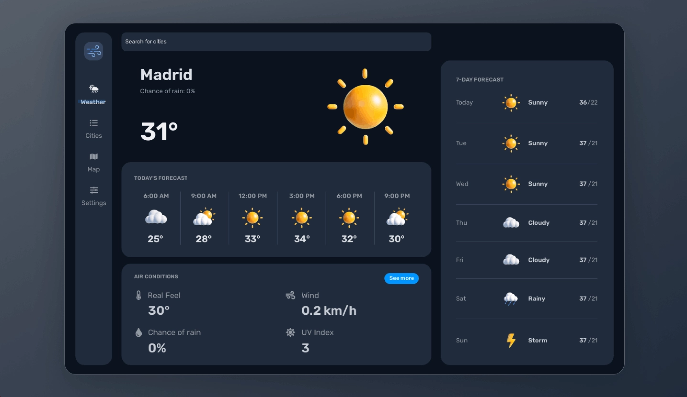

# frontend-project

frontend project using Vanilla JS, event listeners, and AJAX

## Weather App

- design credit @ https://uizard.io/templates/web-app-templates/weather-web-app-light/

<!--  -->

### Learning points

- Spend a long time looking at the JSON object from the API, figure out what you're going to need and then extract it in a asap.
- whatthefont
- SVG's from https://www.svgrepo.com/
- use https://flexboxfroggy.com/ religiously, skip through to go to the one you're trying to apply
- change background color or add border color when tweaking styles, to easily see the parent container

### Future additions

- autofill cities as the user types
- incorporate dark mode
